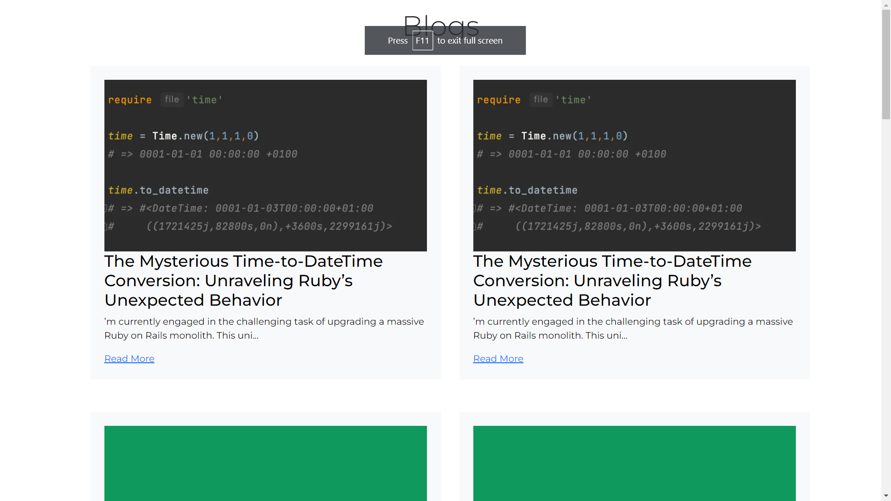
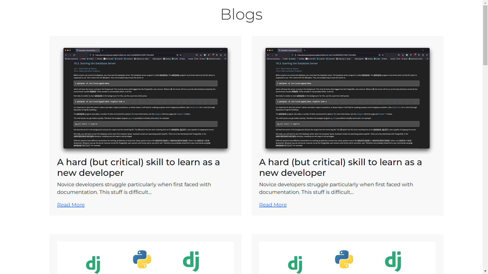
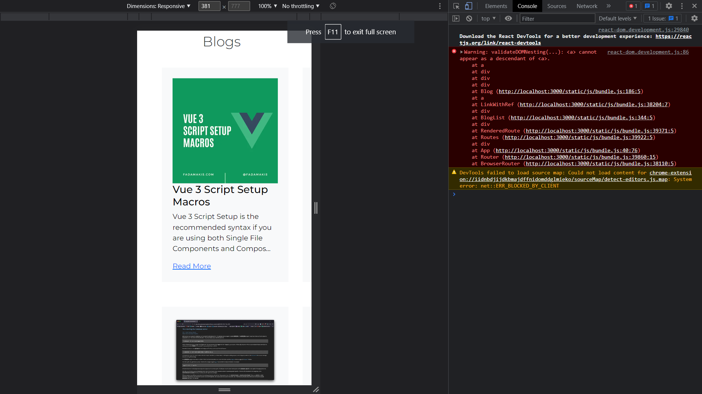
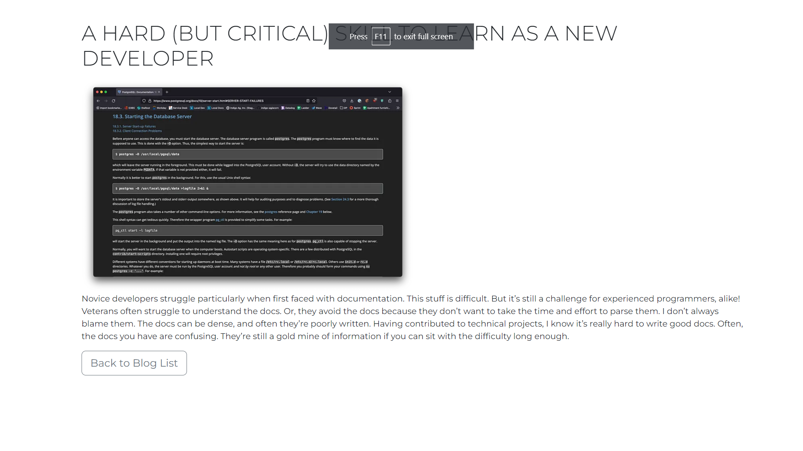

# AppsDeployer Blog App assignment


## Authors
Ashish Sengar
- [@github](https://www.github.com/Ashishss21)
- [@LinkedIn](https://www.github.com/Ashishss21)
- [@Website](https://www.ashishsengar.netlify.app)


## Documentation

Features
- Blogger app should consist of one blog page and it should display nth number of blogs.
- Nth blog will be received from (object of array) in json.
- On every refresh the blogs order should change
- Blog page UI should be responsive.
- Submit the task in GitHub repo.
- GitHub repo must have readme with details of task.
- Add screen recording of blogger app in readme file.

## Installation

Install my-project with npm

```bash
  npm install my-project
  cd my-project
```
    


## Acknowledgements

 - [Awesome Readme Templates](https://awesomeopensource.com/project/elangosundar/awesome-README-templates)
 - [Awesome README](https://github.com/matiassingers/awesome-readme)


## Screenshots







